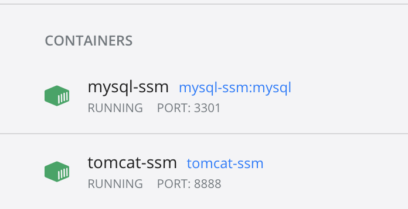
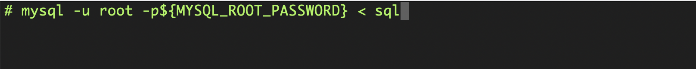

# Web Application Start Guide
This documentation helps to run the application in this repository.

1. Prepare the Docker environment 
   * For OS X: [click here](https://docs.docker.com/docker-for-mac/install/)
   * For Windows: [Windows Home](https://docs.docker.com/docker-for-windows/install-windows-home/) 
     or [Windows Pro](https://docs.docker.com/docker-for-windows/install/)
   * For linux: [click here](https://docs.docker.com/engine/install/)
2. Download only the folder [livrable](livrable)
3. Use command line tool to go into the livrable folder you just downloaded
   * Attention : Windows users need to use PowerShell. Normally, it is already installed in your computer,
     and you can start it by push win + R at the same time and type in powershell
4. Build two containers by command : `docker-compose up -d`
5. Open the Docker Desktop application, you will see a livrable running like : 
6. Click it and you will see two containers : 
7. Click mysql-ssm and click the cli icon here : 
8. Now you should see a command line window. Type in command : `mysql -u root -p${MYSQL_ROOT_PASSWORD} < sql` 
9. Wait a few minutes for the preparation of data
10. Visit the website by http://localhost:8888/OceangraphicData/